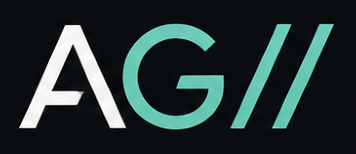

## About



## Links

### Memory App

 

[Get it on Google Play](https://play.google.com/store/apps/details?id=com.example.dummyapp)

### GitHub Repo

Placeholder description of a project repository. Replace with the real GitHub link.

[View on GitHub](https://github.com/example/dummy-repo)
